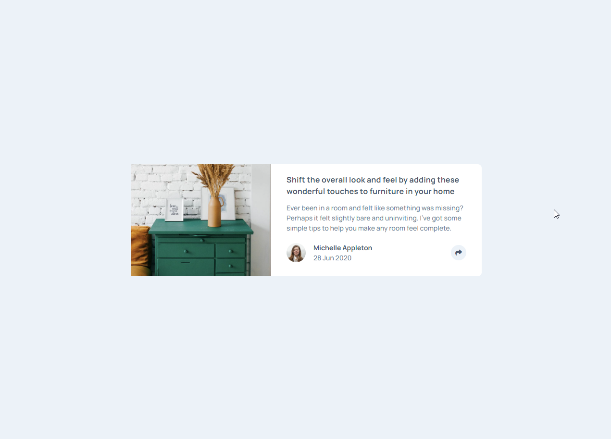
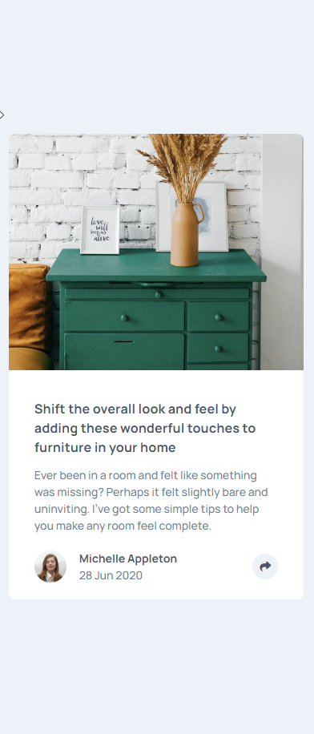

# Frontend Mentor - Article preview component solution

This is a solution to the [Article preview component challenge on Frontend Mentor](https://www.frontendmentor.io/challenges/article-preview-component-dYBN_pYFT). Frontend Mentor challenges help you improve your coding skills by building realistic projects. 

## Table of contents

- [Overview](#overview)
  - [The challenge](#the-challenge)
  - [Screenshot](#screenshot)
  - [Links](#links)
- [My process](#my-process)
  - [Built with](#built-with)
  - [What I learned](#what-i-learned)
  - [Continued development](#continued-development)
- [Author](#author)

## Overview

### The challenge

Users should be able to:

- View the optimal layout for the component depending on their device's screen size
- See the social media share links when they click the share icon

### Screenshot




### Links

- Live Site URL: [Live Website](https://damasio-preview-card-component.netlify.app/)

## My process

### Built with

- Semantic HTML5 markup
- CSS custom properties
- Flexbox
- Mobile-first workflow
- TailwindCSS

### What I learned

How to add and remove focus of an element and how to use it to toggle it's visibility and add cool features to a website.

I also learned that focusing elements that are off screen will make the screen break if focused while animating in.

I've built a function that can delay those animations and which helped make the code cleaner.

I also make the function that adds hide and show animation to the tooltips responsive the screen sizes using the `clientWidth` property  I didn't know about before

```js
const tooltipToggles = document.querySelectorAll("[data-toggle='tooltip']")

Array.from(tooltipToggles).forEach(tooltipToggle => {
  tooltipToggle.addEventListener('click', () => {
    const screenWidth = document.documentElement.clientWidth

    if (screenWidth < 640) {
      const targetElement = document.querySelector('#mobile-tooltip')
      targetElement.classList.remove('c-tooltip-hidden')
      HideAnimation(targetElement, 500)
    }

    if (screenWidth > 640) {
      const targetElement = document.querySelector('#desktop-tooltip')
      targetElement.classList.remove('c-tooltip-hidden')
      HideAnimation(targetElement, 400)
    }
  })
})

const HideAnimation = (targetElement, timeOut) => {
  setTimeout(() => {
    targetElement.focus()
  }, timeOut)

  document.body.addEventListener('click', () => {
    setTimeout(() => {
      if (document.activeElement !== targetElement) {
        targetElement.classList.add('c-tooltip-hidden')
      }
    }, timeOut)
  })
}
```

### Continued development

I'm looking forward to building more complex projects using vanilla JavaScript so I can understand how complex DOM manipulation works. I believe it will help me understand how frameworks like React work and how to work with them

## Author

- Website - [Wellington Damasio](https://wellington-damasio.com)
- Frontend Mentor - [@wellington-damasio](https://www.frontendmentor.io/profile/wellington-damasio)

**Note: Delete this note and add/remove/edit lines above based on what links you'd like to share.**
